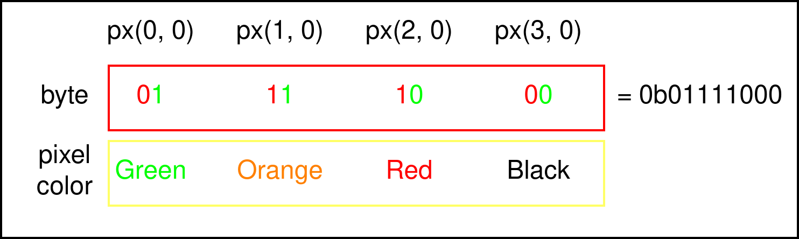

# Mesmetron API
## Abstract
Enables anyone to send data to the Mesmetron LED Board.
The board has a size of 200 x 32 pixels and supports the colors red, green, orange and black.
## Connection
The server is accepting sockets on `94.45.239.116` port `5000`. Once the socket is established the server expects 1600 bytes of data until it updates the board.
## Data format
The board has a width of 200 pixels and a height of 32 pixels. It is capable of three(technically 4) colors. Red, green, orange and black.
The origin of the board is in the top left corner. Each byte controls 4 pixels. The Layout is as follows:

This repeats for the total width of the board, so for 50 bytes, after that the cursor resets to first pixel in the next row down. This repeats until the frame is written completely.
